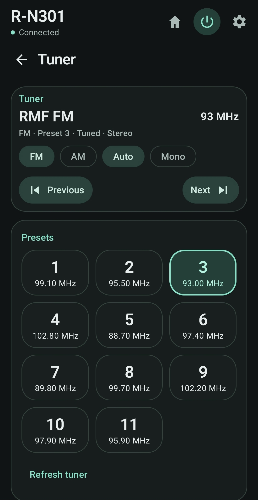
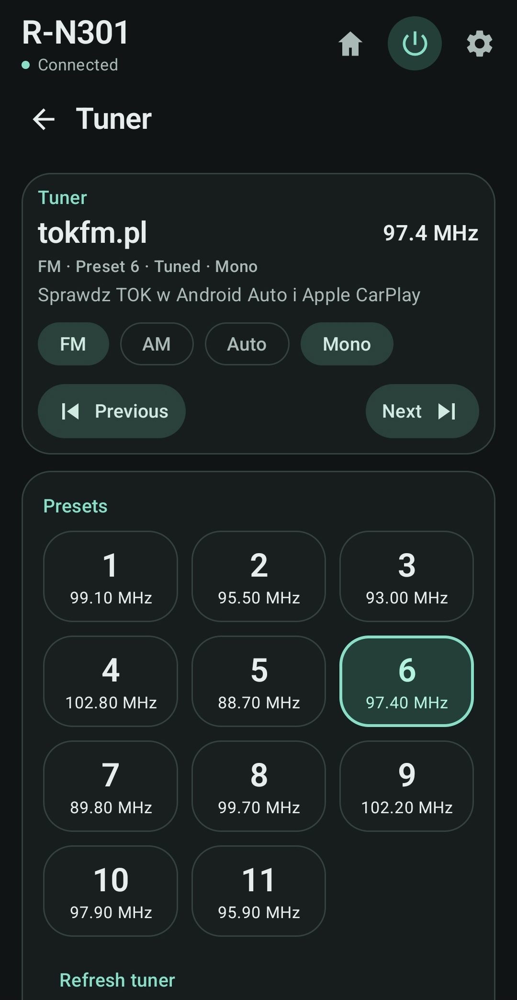
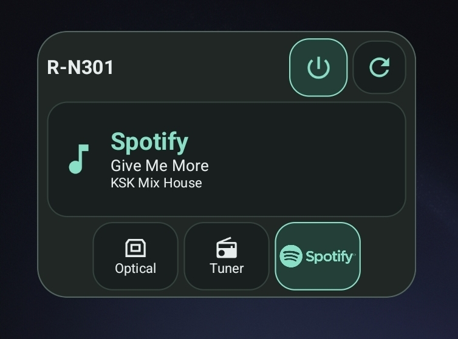

# Yamaha Receiver Controller

A native **Android controller for compatible Yamaha network receivers**, built around the **Yamaha legacy XML API**. **Yamaha R-N301** is the primary physically verified receiver. Control volume, sources, DLNA media and Internet Radio directly through the receiver, without an application cloud backend, Yamaha account or Spotify account integration in the app.

**Release version: v1.2.0 (code 17) · Android 8.0+ · Eight languages · MIT**

[Download from GitHub Releases](https://github.com/STYL15HH1/Yamaha-Receiver-Controller/releases) · [Release notes](docs/RELEASE_NOTES_v1.2.0.md) · [Protocol documentation](docs/YAMAHA_PROTOCOL.md)

**Independent open-source project. Not affiliated with or endorsed by Yamaha Corporation.**

## Screenshots

<table>
<tr>
  <td align="center" valign="top"> <strong>Home &amp; rotary volume</strong></td>
  <td align="center" valign="top"> <strong>Tuner &amp; presets</strong></td>
  <td align="center" valign="top"> <strong>Tuner / RDS</strong></td>
  <td align="center" valign="top"> <strong>Source selection</strong></td>
</tr>
<tr>
  <td align="center" valign="top"> <strong>Application language</strong></td>
  <td align="center" valign="top"> <strong>Net Radio catalogue</strong></td>
  <td align="center" valign="top"> <strong>Four Favorites</strong></td>
  <td align="center" valign="top"> <strong>Compact Home &amp; Spotify</strong></td>
</tr>
<tr>
  <td align="center" valign="top"> <strong>Home Screen Widget</strong></td>
</tr>
</table>

Final v1.2.0 Widget and Tuner captures are shown alongside earlier screenshots of unchanged features. Images retain their supplied content and proportions. Radio metadata and catalogue contents come from the receiver and may vary.

## New in v1.2.0

The signed v1.2.0 APK has been physically accepted on Yamaha R-N301. GitHub publication is pending a separate manual step; the repository and local upload assets are prepared for release.

### Home Screen Widget

- Power On / Standby, manual Refresh, current source and source-specific station/track metadata.
- Up to four Favorite Sources: one to three are centered; four fill the row. The selected source is highlighted.
- Responsive resizing, light/dark appearance, and an offline/cached state with a stale update time.
- No continuous background polling and no volume controls. All instances use the saved receiver and existing favorites.
- Add it through the launcher's widget picker after connecting in the app; tap the information area to open the app.

### Tuner

- Compact player with station and frequency on one row, a compact status line and one-line Radio Text with ellipsis.
- FM / AM / Auto / Mono controls share one row when width permits; Previous / Next remain available. The shorter player leaves more presets visible without scrolling.
- Preset tiles show a dominant number and smaller, single-line stored frequency, such as `99.10 MHz` or `1134 kHz`.
- The receiver remains the source of truth. Existing tuner refresh reloads stored frequencies; there is no local preset-frequency database or RDS scanning. The preset count stays dynamic and uses the receiver's returned list.

### Compatibility Report

Open **Settings → Receiver → Compatibility Report** for read-only GET diagnostics: model and firmware, a capability map, Tuner / RDS / presets, and SERVER / NET RADIO / Spotify / AirPlay information where available. Declared capability, successful API reads and runtime readiness are distinct: “Not Ready” does not mean unsupported. AirPlay information is declaration-based where advertised.

Use **Copy Report** or **Share Report** explicitly. No automatic telemetry or uploads occur. Export excludes IP address and System_ID, as well as raw XML, raw errors, network identifiers and station/track metadata. Unfamiliar identity formats may appear as unknown.

Only **Yamaha R-N301** is physically verified. Reports can diagnose another local Yamaha model without enabling normal controls or establishing physical compatibility. See the [v1.2.0 release notes](docs/RELEASE_NOTES_v1.2.0.md) and [final validation](docs/VALIDATION_v1.2.0.md).

## Features

| Area | Controls and capabilities |
| --- | --- |
| Receiver | Automatic SSDP discovery, saved receiver reconnect, manual IPv4/hostname fallback, receiver status, Power / Standby and firmware information |
| Volume | Native Yamaha values, live rotary control, precision − / + and Mute / Unmute |
| Favorites | Up to four configurable quick sources, with saved order |
| Tuner | FM / AM, saved-preset recall, manual tuning, seek, FM Auto / Mono and available RDS metadata |
| Spotify | Receiver-provided track/artist/album metadata and Previous / Play-Pause / Next |
| SERVER / DLNA | Browse receiver-visible media in continuous lists with automatic pagination, local search, folder navigation and playback controls |
| Net Radio | Multi-level receiver catalogue browsing, search within the loaded menu, station selection, Now Playing and Stop |

Sources include **Tuner, CD, Optical, Line 1–3, Spotify, SERVER, Net Radio and AirPlay**, plus **Coaxial when advertised/supported by the receiver**. AirPlay is source selection only. Available controls reflect the receiver's supported capabilities.

Volume remains in native receiver units; the app does not invent a dB conversion. Spotify is controlled through the R-N301, without a Spotify SDK, Web API or OAuth flow.

SERVER and Net Radio share a compact browser toolbar and continuous lists. Search filters only the loaded directory on the phone. **App Home** in the receiver header returns to the main Receiver screen without changing input or playback. The separate **Server root / Radio root** folder button returns to the current catalogue root. Receiver / Now Playing navigation remains available below each browser.

## Languages and appearance

Choose **System default** or English, Español, Deutsch, Français, Italiano, Polski, 한국어 or 日本語.

Appearance supports **System / Light / Dark**, with saved preferences.

## Compatibility

**Yamaha R-N301 is the primary and physically tested target.** The application communicates through Yamaha's legacy local XML control endpoint: `/YamahaRemoteControl/ctrl`.

Other Yamaha network receivers exposing the same legacy XML API may be partially or fully compatible. Yamaha R-N500 and selected older RX-V and RX-A receivers are potential compatibility candidates only; they are not claimed as supported, verified or tested. The current connection check still requires an R-N301 model identification; the diagnostic report does not broaden normal device acceptance.

Compatibility can vary because receivers expose different inputs, tuner capabilities, network services and XML command trees.

If you test another receiver, please [open a GitHub issue](https://github.com/STYL15HH1/Yamaha-Receiver-Controller/issues) with the exact Yamaha model, working features and non-working features.

### Tested devices

| Device / feature | Yamaha R-N301 |
| --- | --- |
| Device/model status | Verified |
| Power | Verified |
| Volume/Mute | Verified |
| Sources | Verified |
| Tuner | Verified |
| Spotify | Verified |
| NET RADIO | Verified |
| SERVER/DLNA | Verified |

## Requirements

- A **Yamaha R-N301** network receiver. Other Yamaha models have not been validated and are not guaranteed to work.
- **Android 8.0 or newer** (minSdk 26).
- Phone and receiver reachable on the same local network, with the receiver's network features available.
- Network standby enabled on the receiver if you want to wake it from standby.

Manual connection is available when the network blocks multicast discovery.

## Installation

1. Once v1.2.0 is published, open [GitHub Releases](https://github.com/STYL15HH1/Yamaha-Receiver-Controller/releases).
2. Download the signed **Yamaha-Receiver-Controller-v1.2.0.apk** release asset.
3. Open the APK on your phone and, when prompted, allow installation from the trusted browser or file manager.
4. Discover your receiver or enter its address in Settings.

Android may display security or Play Protect warnings for applications installed outside Google Play. Verify the download source and review any warning before proceeding; do not disable Play Protect globally.

Updates require the same package and signing identity. A differently signed development installation cannot be updated in place with the production APK; uninstalling it removes local settings.

## Net Radio and YTuner

The app browses the Internet Radio catalogue **exposed by the receiver**. Catalogue navigation and station selection use Yamaha XML; the receiver retrieves and plays the audio. The app does not proxy radio streams, query Radio Browser directly, or submit arbitrary stream URLs.

The receiver can use its normal Internet Radio service where available. **YTuner is not an application dependency and is not bundled.** Advanced users may independently configure it at receiver/network level as a self-hosted catalogue alternative. Service availability and catalogue contents depend on the chosen backend.

## Privacy and network model

Receiver control happens over the local network. The app has **no analytics, advertising, telemetry, application cloud backend or required user account**.

Legacy receiver control uses cleartext HTTP. The transport restricts destinations to local/private IPv4 addresses, uses fixed receiver endpoints and disables proxies/redirects. Discovery uses SSDP multicast. Hostnames are resolved through Android's network resolver; numeric addresses avoid hostname lookups. The author link opens an external browser only when selected.

The receiver and its Spotify, radio or DLNA services have their own network behavior; this app does not provide or authenticate those services.

## Architecture

~~~text
Jetpack Compose
    ↓
ViewModel / StateFlow
    ↓
YamahaRepository
    ↓
Yamaha XML protocol / HTTP transport
    ↓
Yamaha R-N301
~~~

XML construction and parsing are isolated from Compose. Communication stays local, and the app does not proxy audio. SERVER and Net Radio content is handled by the receiver itself.

## Build from source

Use **JDK 17**, the checked-in **Gradle 9.6.0 wrapper**, Android SDK platform 37 and build tools 36.0.0. Accept SDK licenses and configure ANDROID_HOME or an untracked local.properties.

~~~sh
./gradlew testDebugUnitTest assembleDebug
~~~

Use gradlew.bat on Windows. Debug APKs are for development, not the normal end-user installation.

Signed release builds use owner-controlled Gradle properties configured outside the repository:

- YAMAHA_RELEASE_STORE_FILE
- YAMAHA_RELEASE_KEY_ALIAS
- YAMAHA_RELEASE_STORE_PASSWORD
- YAMAHA_RELEASE_KEY_PASSWORD

~~~sh
./gradlew assembleRelease lint lintRelease
~~~

Release builds fail if signing properties are missing; debug builds remain independent. Never commit keystores or signing credentials. See [release preparation](docs/RELEASE_PREPARATION.md) for validation and signing evidence.

## Known limitations

- Other receiver models are not guaranteed.
- AirPlay is input selection only; Spotify Stop, Shuffle and Repeat are not implemented.
- Preset storage, tone controls, speaker A/B selection and Sleep are not implemented.
- SERVER and Net Radio search cover the loaded menu, not the entire catalogue. Loading is bounded to 64 pages and 90 seconds; large or slow menus can reach those limits.
- Another controller can change the receiver menu during browsing. Unavailable services/media and missing metadata are reported without inventing content.
- No direct stream URLs or artwork fetching. Widget actions use finite background jobs; there is no continuous background polling.

## Documentation

- [Yamaha protocol and verified commands](docs/YAMAHA_PROTOCOL.md)
- [Capability audit and unresolved features](docs/RN301_CAPABILITY_AUDIT.md)
- [Discovery](docs/DISCOVERY.md)
- [Final v1.2.0 validation](docs/VALIDATION_v1.2.0.md)
- [Widget implementation notes](docs/WIDGET_REFINEMENT_v1.2.0.md)
- [Physical test findings](docs/PHYSICAL_TEST_CHECKLIST.md)
- [v1.2.0 release notes](docs/RELEASE_NOTES_v1.2.0.md)
- [Third-party notices](THIRD_PARTY_NOTICES.md)

## License and attribution

Original project source is licensed under the [MIT License](LICENSE). Third-party resources and supplied brand artwork retain their respective ownership and terms; the MIT license does not grant trademark or logo rights.

Yamaha is a trademark of Yamaha Corporation, Spotify of Spotify AB, and AirPlay of Apple Inc. This project is not affiliated with, endorsed by, or supported by those companies.

Created by [STYL15HH1](https://github.com/STYL15HH1).
